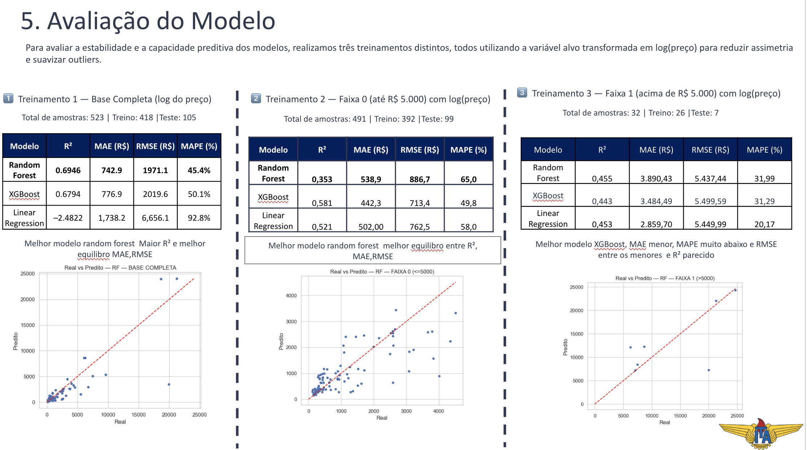

# 🧠 Projeto de Ciência de Dados ITA 2025.02  
# 🛠️ Precificação Automatizada de Peças Usinadas com Machine Learning aeronáutica

Este repositório contém todo o pipeline desenvolvido para previsão de preço de peças usinadas utilizando **modelagem estatística**, **análise exploratória de dados (EDA)** e **três modelos de Machine Learning (Regressão Linear, Random Forest e XGBoost)**.

O objetivo principal foi determinar:
> **Qual modelo prediz melhor o preço das peças?**  
> **E como o comportamento muda quando segmentamos a base em faixas de preço?**

Todo o processo foi documentado e seguiu uma estrutura analítica e metodológica clara.

---

# 📌 Objetivo do Projeto

Desenvolver um modelo capaz de **prever automaticamente o preço** de usinagem com base nas características físicas das peças:

- Peso da matéria-prima  
- Peso final da peça  
- Cavaco (material removido)  
- Comprimento  

Com isso, reduzimos o tempo de orçamento e melhoramos a padronização de preços.

---

# 🎯 Fluxo de Trabalho do Projeto
# 🛠️ Precificação Automatizada de Peças Usinadas com Machine Learning

Este repositório contém todo o pipeline desenvolvido para previsão de preço de peças usinadas utilizando **modelagem estatística**, **análise exploratória de dados (EDA)** e **três modelos de Machine Learning (Regressão Linear, Random Forest e XGBoost)**.

O objetivo principal foi determinar:
> **Qual modelo prediz melhor o preço das peças?**  
> **E como o comportamento muda quando segmentamos a base em faixas de preço?**

Todo o processo foi documentado e seguiu uma estrutura analítica e metodológica clara.

---

# 📌 Objetivo do Projeto

Desenvolver um modelo capaz de **prever automaticamente o preço** de usinagem com base nas características físicas das peças:

- Peso da matéria-prima  
- Peso final da peça  
- Cavaco (material removido)  
- Comprimento  

Com isso, reduzimos o tempo de orçamento e melhoramos a padronização de preços.

---

# 🎯 Fluxo de Trabalho do Projeto

---

# 📊 1. Análise Exploratória (EDA)

### 🔹 Distribuição de Preços  
Os preços vão de **R$ 48 até R$ 106.450**, apresentando forte assimetria.  
Por isso, aplicou-se **log(preço)** para suavizar cauda longa.

### 🔹 Correlação das Variáveis  
As maiores correlações foram:

- `peso_mp` – `cavaco` – `peso_peca` → **altamente correlacionados (0.90+)**
- Isso indica **multicolinearidade**
- E explica por que **árvores** (RF/XGBoost) performam melhor que Regressão Linear

### 🔹 Segmentação em 2 faixas

| Faixa | Critério | Qtde |
|-------|----------|-------|
| **0** | Preço ≤ 5.000 | 491 peças |
| **1** | Preço > 5.000 | 32 peças |

---

# 🔥 2. Modelagem – Versão com log(preço)

Todos os modelos foram treinados com o alvo transformado:

Isso reduz influência de outliers e melhora estabilidade dos modelos.

---

# 📘 3. Treinamento 1 — Base Completa (523 peças)

| Modelo | R² | MAE (R$) | RMSE (R$) | MAPE (%) |
|--------|-------|-----------|-----------|------------|
| **Random Forest** | **0.6946** | **742.91** | **1971.1** | **45.4%** |
| XGBoost | 0.6794 | 776.90 | 2019.6 | 50.1% |
| Linear Regression | -2.4822 | 1738.20 | 6656.1 | 92.8% |

🎯 **Melhor modelo:** Random Forest  
📌 Motivo: melhor R², MAE e RMSE simultaneamente.

---

# 📘 4. Treinamento 2 — Faixa 0 (preços até R$ 5.000)

| Modelo | R² | MAE (R$) | RMSE (R$) | MAPE (%) |
|--------|-------|-----------|-----------|------------|
| **Random Forest** | **0.581** | **442.3** | **713.3** | **49.8%** |
| XGBoost | 0.521 | 502.0 | 762.5 | 58.0% |
| Linear Regression | 0.353 | 538.8 | 886.7 | 65.0% |

🎯 **Melhor:** Random Forest  
📌 Melhor estabilidade nas peças de baixo valor.

---

# 📘 5. Treinamento 3 — Faixa 1 (preços acima de R$ 5.000)

| Modelo | R² | MAE (R$) | RMSE (R$) | MAPE (%) |
|--------|-------|-----------|-----------|------------|
| Random Forest | 0.443 | 3484.48 | 5499.6 | 31.29% |
| **Linear Regression** | 0.453 | 2859.70 | 5449.9 | **20.17%** |
| XGBoost | 0.455 | 3890.43 | 5437.4 | 31.99% |

🎯 **Melhor:** Linear Regression para essa faixa específica  
📌 Apesar de baixo R² (poucas amostras), teve **menor MAPE**.

---

# 🏆 Comparação Geral — Melhor Modelo do Projeto

| Treinamento | Melhor Modelo | Motivo |
|-------------|----------------|---------|
| Base Completa | **Random Forest** | Melhor R², MAE e RMSE |
| Faixa 0 | **Random Forest** | Melhor estabilidade e erro menor |
| Faixa 1 | **Linear Regression** | Menor MAPE apesar do baixo N |

### 🟦 **Conclusão Final**
O modelo **Random Forest** apresentou melhor desempenho **na maioria dos cenários**, e é o mais indicado para uso real.

---

# 📎 6. Gráficos Real vs Predito

---
# 🧠 Autores:
Gabriel Farias
Jardel
João Pedro
Victor Olegario
